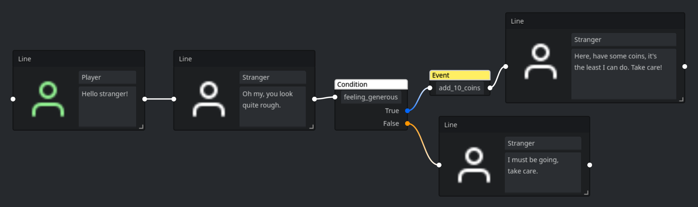

# Dianodes - A Dialogue System for Godot 4

> ⚠️ Bear in mind the plugin is in very early development. APIs are rough at the moment and I cannot guarantee non-breaking changes to the API or resource structure. Feel free to voice your opinion and open issues!
>
> For a more fully featured dialogue editor, take a look at [Dialogue Manager for Godot 4](https://github.com/nathanhoad/godot_dialogue_manager) by [Nathan Hoad](https://nathanhoad.net/).

A node-based dialogue system for the Godot Engine.

## What this plugin includes ⚙️

The plugin currently includes the features below.

- `🌳 Graph Editor` - Create dialogue graphs using a node-based editor
- `🗣️ Line Nodes` - Add lines with support for multiple dialogue options
- `🔀 Condition Nodes` - Create conditional dialogue flows by string referencing callables or variables
- `⚡ Event Nodes` - Call functions by referencing callables by name using 
- `❓ Variables` - Reference variables that are replaced by their value at runtime
- `🌍 Singleton` - An autoload singleton to start dialogues and have nodes connect to dialogue signals
- `👀 Preview Functionality` - Preview dialogue graphs using the in-editor Run button

## What this plugin does not include ⛔️

- `Dialogue UI` - While providing an example UI, you need to bring your own UI scenes and logic.
- `File operations` - The plugin directly edits Dialogue resource files. 
  - This means no save buffers or undo history - you open the resource file and edit it directly in the inspector.

## Working on 👷🏼

The list below outlines things currently being worked on.

- In-editor translation support

## The wishing well 🪙

Below you will find a list of features that might be interesting moving forwards.

- ⌨️ Inline condition expression support for condition nodes
- ✉️ Parameter support for event nodes
- 📝 More ergonomic variables/events/conditions blackboarding
- 🔙 Undo history
