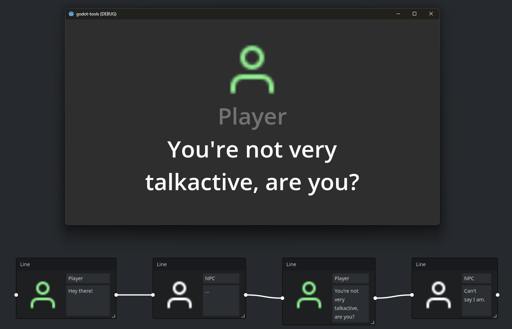

# Dialogue System 💬

> ⚠️ Bear in mind the plugin is in very early development. APIs are rough at the moment and require C#. Feel free to voice your opinion and open issues!
>
> For a more fully featured dialogue editor, take a look at [Dialogue Manager for Godot 4](https://github.com/nathanhoad/godot_dialogue_manager) by [Nathan Hoad](https://nathanhoad.net/).
> 
A node-based dialogue system for the Godot Engine. It requires a Godot version with .NET support since it's fully implemented in C#.

## Current features ⚙️

The plugin currently includes the features below.

- 🌳 Create dialogue graphs using a node-based editor
- 🗣️ Add dialogue lines and character portraits
- 🔀 Non-linear dialogue flow by referencing condition callbacks
- ⚡ Fire parameterless (for now) events by referencing action callbacks

## Working on 👷🏼

The list below outlines things currently being worked on.

- 📝 Dialogue options
- ❓ Variable lookup for templated dialogue lines

## The wishing well 🪙

Below you will find a list of features that might be interesting moving forwards.

- ⌨️ Inline condition expression support for condition nodes
- 💾 Intercept editor shortcuts, such as Ctrl-S to increase affordance
- ✉️ Parameter support for event nodes
- 📝 More ergonomic variables/events/conditions blackboarding
- ⚙️ GDScript version with full feature parity

